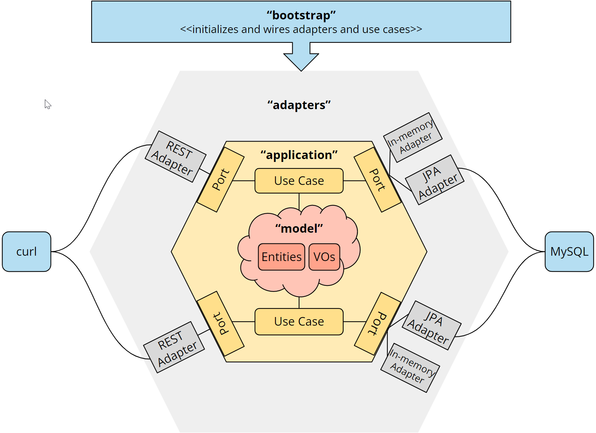

# Hexagonal Architecture with Java and Spring Boot

This project contains a simple Java/Spring Boot application implemented according to hexagonal architecture in multiple steps.

## Technologies used
* **JDK 21** - Core language
* **Junit5** - Unit Testing
* **Mockito** - Mocking objects while Unit testing
* **AssertJ** - Simple assertion style while Unit testing
* **Lombok** - Auto generates boilerplate code for POJOs
* **RESTful Web Services (JAX-RS)** - To implement REST Adapters (Step 1,2)
* **Undertow** - Web server (Step 1,2)
* **Jakarta Persistence (JPA)** - Java persistence specification api (Step 2)
* **Hibernate** - Persistence Implementation Framework
* **MySql** - Database 
* **TestContainers** - A framework that allows us to launch a MySQL database as a Docker container from tests.
* **Docker** - To run MySQL and Sonar as containers. Just install Docker Desktop and done
* **Jacoco** - To analyze code coverage
* **SonarQube** - To analyze ugs and issues
* **Spotless** - To analyze and format the code
* **Static Code Analysis** - By SpotBugs, PMD, Google Checkstyle (_If using Sonar then not req as most of the rules are now part of Sonar_)
* **CustomLog** - Slf4j Logging support using Lombok CustomLog


## Important Plugins for Intellij
* **HTTP Client** - Required to run sample http commands from document/sample-requests.http (Step 1,2)
* **JUnit**
* **Lombok**
* **Jakarta EE: RESTful Web Services (JAX-RS)** (Step 1,2)
* **Jakarta EE: Persistence (JPA)** (Step 2)
* **Spring DATA**


## What is a Hexagonal Architecture?
Alistair Cockburn introduced the hexagonal software architecture as follows
* All non-technical business logic must reside in Application core and must be invoked by User, External application or automated Tests without any difference.
* All communication to the Application core from external entities say User, Database or Test suite must happen through Ports (Interfaces).
* An Adapter is like a middleman who will control the communication between External entities and Application core via Ports. 


Hexagonal architecture with control flow (www.happycoders.eu)

# Application overview
The application mimics a simplified online store with following functionalities:

* Product search
* Adding a product to the shopping cart
* Retrieving the shopping cart with the products, their respective quantity, and the total price
* Emptying the shopping cart

### Note:
* The amount of a product added to the cart must be at least one.
* After adding a product, the total quantity of this product in the cart must not exceed the amount of the product available in the warehouse.
* After emptying the Cart there should be no products available in the Cart

# Architecture Overview
The application will be developed in following steps:

* **Step 1** - Hexagonal Architecture without any application framework say Spring. The code will only use JDK 21, RESTEasy and Undertow (lightweight server).
* **Step 2** - Replace In-Memory Database with JPA and MySQL
* **Step 3** - Add [Spring Boot](https://spring.io/projects/spring-boot/) framework
* **Final** - Add support of Logger, Sonar, Jacoco code coverage, Static code analysis i.e. Spotless, Spotbugs, Google checkstyle, PMD

The source code has four modules:
* `model` - It contains the domain models
* `application` - It contains the domain services and the ports
* `adapter` - It contains the adapters like REST, In-memory and JPA
* `boostrap` - It contains the configuration and bootstrapping logic like instantiating adapters/domain services and running Undertow web server

The following diagram shows the final hexagonal architecture of the application along with the source code modules.


<br>


Hexagonal Architecture modules (www.happycoders.eu)

## Lombok annotations used in project
* **@RequiredArgsConstructor** - Generates constructor that take one argument per final / non-nullfield
* **@AllArgsConstructor** - Generates constructor that take one argument for every field.
* **@Data** - A shortcut for @ToString, @EqualsAndHashCode, @Getter on all fields, and @Setter on all non-final fields, and @RequiredArgsConstructor!
* **@Accessors** 
* * **fluent** – A boolean. If true, the getter for pepper is just pepper(), and the setter is pepper(T newValue). Furthermore, unless specified, chain defaults to true.
  Default: false.
* * **chain** – A boolean. If true, generated setters return this instead of void.
  Default: false, unless fluent=true, then Default: true.
* **@Getter/@Setter** - Generates getter/setter methods for the fields
* **@ToString** - Generates a toString method for the class
* **@EqualsAndHashCode** - Generates hashCode and equals implementations from the fields of your object
* **@CustomLog** - Generates Custom Logger object for the class based on Logging library as defined in **_lombok.config_** file
```
lombok.log.custom.declaration = org.slf4j.Logger org.slf4j.LoggerFactory.getLogger(NAME)(TOPIC)

```

## How to run
* **Spring Boot Profile** - Use the Spring boot profile **_mysql_** while running the app. Default is **_inmemory_**
```
-Dspring.profiles.active=mysql
```
* Based on the System property value of '**persistence**' key (_'inmemory'/'mysql'_) we can run the application with 
* **InMemory DB** - Data will persist till the application is running
* **MySql DB** - We can either run a local MySql server (**DB-_shop_, Root Pwd-_test_**) or run a Docker container
```
docker run --name hexagon-mysql -d -p3306:3306 -e MYSQL_DATABASE=shop -e MYSQL_ROOT_PASSWORD=test mysql:8.1
```
* You can invoke HTTP commands from '**documents/sample-requests.http**' directly from Intellij

## Code analysis
* **Spotless** - run **_mvn spotless:apply_** to auto reformat the code if there is any issue during build
* **Static code analysis** - For Static code analysis with Spotbugs, PMD and Google Check style run
```
mvn clean verify -Dspring.profiles.active=code-inspection -DskipTests=true
```
## Running SONAR from Zip file with JDK 17+ on your system
* As per May 2024, Sonar supports up to JDK17 with some issues with ElasticSearch. 
* So if you have any latest version of JDK installed then please install JDK 17 separately.
* Create an Environment variable to point to the Java executable file of JDK17 i.e. 
```
SONAR_JAVA_PATH = C:\Program Files\Java\jdk-17.0.1\bin\java.exe (Windows)
```
* And run the StartSonar.bat 
```
C:\sonarqube\bin\windows-x86-64\StartSonar.bat
```
* Please refer the https://docs.sonarsource.com/sonarqube/latest/try-out-sonarqube/ page for latest steps

## Running Sonar from docker image
* If Docker is already installed on your system (as part of MySql TestContainers step)
* Then just execute the following line and you are all set
```
docker run -d --name sonarqube -e SONAR_ES_BOOTSTRAP_CHECKS_DISABLE=true -p 9000:9000 sonarqube:latest
```
### After creating a Project and Token in SonarQube run this for report generation
```
mvn -Dsonar.projectKey=<<PROJECT_KEY>> -Dsonar.projectName='<<PROJECT_NAME>>' -Dsonar.host.url=http://localhost:9000 
-Dsonar.token=<<TOKEN_VALUE>> clean verify sonar:sonar
```


